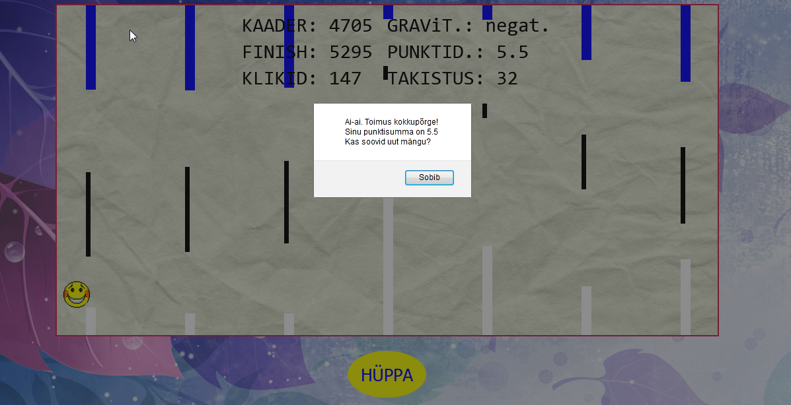

# Flappy-Bird-Clone-in-JS
Flappy Bird game clone created with JavaScript, HTML, CSS

# Features:
* Funny jumping game in JS using canvas
* Alert box with final results

# Gameplay:
* Avoid touching obstacles

# Buttons:
* 'HÜPPA' button for jumping

# Outputs:
* KAADER - frames played
* FINISH - frames until the end
* KLIKID - button clicks
* GRAVIT. - avatars gravity, either positive or negative
* PUNKTID - points
* TAKISTUS - obstacle

# GOOD LUCK !
